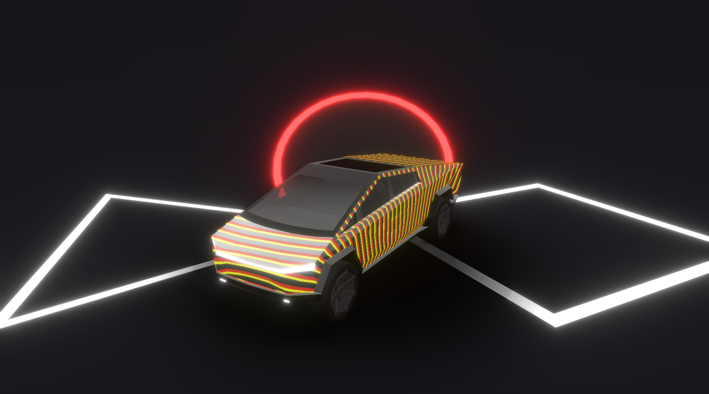

# Cybertruck Shader Showcase

An interactive, animated **Cybertruck** experience built with **React Three Fiber**, **Three.js**, and custom **GLSL shaders**. Explore dynamic shader effects like **polar disks** and **vertical stripes**, animated with time and customizable via a real-time **Leva control panel**.

[](https://shader-truck.netlify.app/)

---

## ✨ Features

* 🚘 **GLTF Cybertruck Model** with animated rotation and lighting effects
* 🎨 **Custom GLSL Shaders** for dynamic visuals: polar **disks** and animated **stripes**
* 🎛️ **Leva Panel** for real-time tweaking of shader uniforms (`uAlpha`, `uMultiplier`, colors)
* 🌀 **GSAP Animation Timeline** for cinematic entrance effects
* 💡 **Dynamic Lighting** with `Lightformer`, **hemisphere light**, and HDR environment
* 🌫️ **Soft Shadows** via `ContactShadows` and bloom with `EffectComposer`
* 🧭 **OrbitControls** for smooth camera interaction

---

## 🧠 How It Works

* Loads a **GLTF Cybertruck model** and assigns shader materials conditionally using Leva's UI state
* Custom shader effects (`stripes` and `disks`) built with `shaderMaterial` and GLSL
* Shader uniforms animated in real-time using `useFrame` for seamless time-based visuals
* Uses **GSAP timeline** to animate the truck drop-in, rotation, and platform transition
* Lighting powered by **Lightformer**, **Environment**, and **Bloom** post-processing
* Scene optimized using `<Canvas shadows>`, `toneMapping`, and `outputEncoding`

---

## 🛠️ Built With

* [**React Three Fiber**](https://docs.pmnd.rs/react-three-fiber) – React renderer for Three.js
* [**Three.js**](https://threejs.org/) – 3D rendering engine
* [**@react-three/drei**](https://github.com/pmndrs/drei) – Useful helpers (`useGLTF`, `Environment`, `ContactShadows`)
* [**GLSL Shaders**](https://thebookofshaders.com/) – Custom fragment and vertex shaders for visual effects
* [**Leva**](https://github.com/pmndrs/leva) – UI controls for tweaking shader values
* [**GSAP**](https://greensock.com/gsap/) – Timeline-based animations
* [**@react-three/postprocessing**](https://github.com/pmndrs/react-postprocessing) – Bloom and post-processing effects

---

## 🚀 Getting Started

```bash
git clone https://github.com/riki-k-dev/shader-truck.git

# Navigate into the project folder
cd cybertruck-shader

# Install dependencies
npm install

# Start the development server
npm run dev

# Build for production
npm run build

# Preview the production build
npm run preview
```

---

## 📄 License

This project is licensed under the **MIT License**.
